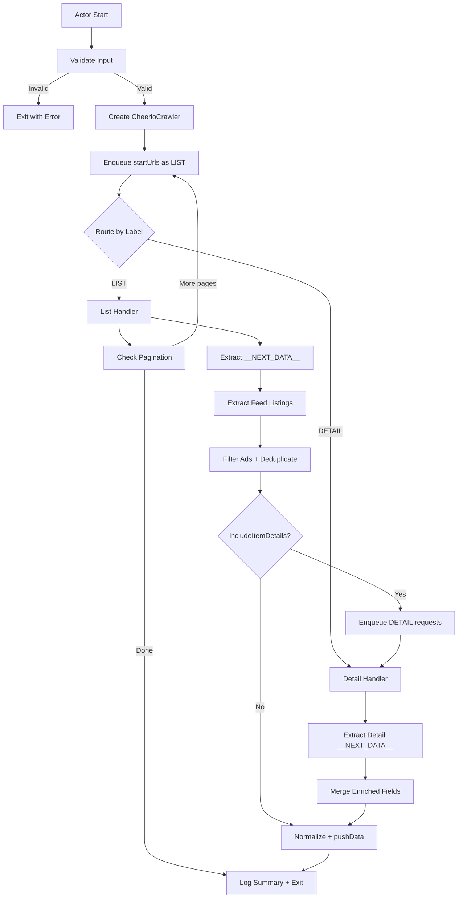

# Design Document: Yad2 Cars Apify Actor

## Overview

This design describes the refactoring of an existing Node.js Yad2 car scraper (`scraper.js`) into a clean, Apify Store-quality actor. The existing script uses raw `fetch` + Cheerio, persists data to local JSON files, and sends Telegram notifications. The new actor replaces all of that with Crawlee's `CheerioCrawler`, Apify Dataset output, and a modular source structure.

The actor accepts one or more Yad2 car search URLs, extracts listing data from `__NEXT_DATA__` JSON embedded in Next.js-rendered pages, handles pagination automatically, optionally enriches listings from detail pages, deduplicates via an in-memory Set, normalizes records to a flat snake_case schema, and pushes them to the Apify Dataset.

### Key Design Decisions

1. **CheerioCrawler over raw fetch**: Crawlee handles retries, concurrency, proxy rotation, and request queuing out of the box. No need to reimplement.
2. **Label-based routing**: Requests are labeled `LIST` or `DETAIL` and dispatched to separate route handlers via Crawlee's `createCheerioRouter()`.
3. **In-memory deduplication**: A `Set<string>` of item tokens is sufficient since the actor runs as a single short-lived process. No need for persistent dedup storage.
4. **Pure utility functions**: Extraction, normalization, and pagination logic are isolated in pure functions for testability.
5. **ES modules**: The project uses `"type": "module"` in `package.json` for modern import/export syntax.

## Architecture



### Request Flow

1. `src/main.js` initializes the Actor, validates input, creates the crawler with a router, enqueues `startUrls` with label `LIST`, and runs the crawler.
2. `src/routes/list.js` handles `LIST` requests: extracts `__NEXT_DATA__`, pulls feed listings, filters ads, deduplicates, optionally enqueues `DETAIL` requests or pushes normalized records directly, and enqueues the next page if applicable.
3. `src/routes/detail.js` handles `DETAIL` requests: extracts `__NEXT_DATA__`, locates the item query, merges enriched fields into the listing data passed via `request.userData`, normalizes, and pushes to the Dataset.
4. Shared state (deduplication Set, counters) is passed to route handlers via closure or a shared context object.

## Components and Interfaces

### Module: `src/main.js` (Entry Point)

Responsibilities:
- Call `Actor.init()` and `Actor.exit()`.
- Read and validate input via `src/input.js`.
- Create `CheerioCrawler` with router, proxy config, concurrency, and request limits.
- Enqueue `startUrls` with label `LIST` and `userData.maxPages`.
- Run the crawler.
- Log a summary (records pushed, pages crawled, duplicates skipped).

### Module: `src/input.js` (Input Validation)

```javascript
/**
 * @param {object} rawInput - Raw input from Actor.getInput()
 * @returns {object} Validated input with defaults applied
 * @throws {Error} If startUrls is missing or empty
 */
export function validateInput(rawInput) { ... }
```

- Applies defaults: `maxPagesPerSearch=10`, `maxRequestsPerCrawl=1000`, `includeItemDetails=true`, `maxConcurrency=5`, `debugLog=false`.
- Throws if `startUrls` is missing/empty.
- Filters out URLs not matching `https://www.yad2.co.il/vehicles/cars*`, logging a warning for each.
- Returns a clean input object.

### Module: `src/routes/list.js` (Search Result Page Handler)

```javascript
/**
 * @param {object} context - Crawlee request handler context ({ request, $, log, crawler })
 * @param {Set<string>} seenTokens - Deduplication set
 * @param {object} stats - Mutable stats counters { pushed, duplicates, pages }
 * @param {object} options - { includeItemDetails, maxPagesPerSearch, debugLog }
 */
export function createListHandler(seenTokens, stats, options) { ... }
```

- Calls `extractNextData($)` to get the JSON payload.
- Calls feed extraction logic to get listings from `commercial` + `private` arrays.
- Filters out `type === "ad"` items.
- For each listing: checks dedup Set, either enqueues DETAIL or normalizes+pushes.
- Calls `getNextPageUrl(request.url, nextData)` and enqueues if within page limits.
- Detects ShieldSquare captcha by checking `$('title').text()`.

### Module: `src/routes/detail.js` (Detail Page Handler)

```javascript
/**
 * @param {object} context - Crawlee request handler context
 * @param {object} stats - Mutable stats counters
 * @param {object} options - { debugLog }
 */
export function createDetailHandler(stats, options) { ... }
```

- Extracts `__NEXT_DATA__` from the detail page.
- Finds the item query by matching `queryKey` containing `"item"` and the token.
- Merges enriched fields (description, phone, test_until, etc.) with `request.userData.listingData`.
- Normalizes and pushes to Dataset.
- On failure, falls back to pushing the listing data from search results only.

### Module: `src/utils/extract-next-data.js`

```javascript
/**
 * @param {CheerioAPI} $ - Cheerio-loaded document
 * @returns {object|null} Parsed __NEXT_DATA__ JSON, or null if not found
 */
export function extractNextData($) { ... }
```

- Selects `script#__NEXT_DATA__`, parses JSON.
- Returns `null` (not throws) on missing/malformed data so callers can handle gracefully.

### Module: `src/utils/normalize-listing.js`

```javascript
/**
 * @param {object} item - Raw listing object from feed or merged with detail data
 * @param {object} options - { debugLog }
 * @returns {object} Normalized_Record with snake_case fields
 */
export function normalizeListing(item, options = {}) { ... }
```

- Maps raw fields to the normalized schema (all 30+ fields).
- Sets missing fields to `null`.
- Derives `seller_type` from `merchant` / `customer.agencyName`.
- Conditionally includes `raw_data` when `debugLog` is true.

### Module: `src/utils/pagination.js`

```javascript
/**
 * @param {object} nextData - Parsed __NEXT_DATA__ object
 * @returns {{ currentPage: number, totalPages: number } | null}
 */
export function getPaginationInfo(nextData) { ... }

/**
 * @param {string} currentUrl - Current page URL
 * @param {number} nextPage - Next page number
 * @returns {string} URL with updated page query parameter
 */
export function buildNextPageUrl(currentUrl, nextPage) { ... }
```

- Extracts pagination metadata from the feed query or page props.
- Constructs next page URL using `URL` + `URLSearchParams`, preserving existing query params.

### Actor Config Files

- `.actor/actor.json`: Actor name `"yad2-cars-scraper"`, version, build config pointing to Dockerfile.
- `.actor/INPUT_SCHEMA.json`: Full JSON schema for all 7 input fields with types, defaults, descriptions.
- `.actor/README.md`: Store-quality documentation.
- `Dockerfile`: Standard Apify Node.js actor Dockerfile.

## Data Models

### Input Schema

| Field | Type | Required | Default | Description |
|---|---|---|---|---|
| `startUrls` | `array<string>` | Yes | — | Yad2 car search result URLs |
| `maxPagesPerSearch` | `integer` | No | `10` | Max pages to crawl per start URL |
| `maxRequestsPerCrawl` | `integer` | No | `1000` | Total HTTP request limit |
| `proxyConfiguration` | `object` | No | — | Apify proxy settings |
| `includeItemDetails` | `boolean` | No | `true` | Fetch detail pages for enrichment |
| `maxConcurrency` | `integer` | No | `5` | Max concurrent requests |
| `debugLog` | `boolean` | No | `false` | Include raw_data in output |

### Normalized_Record (Output Schema)

| Field | Type | Source |
|---|---|---|
| `item_id` | `string` | `token` or `id` |
| `item_url` | `string` | Constructed from token |
| `source` | `string` | Constant `"yad2"` |
| `insertion_time` | `string` | ISO timestamp at push time |
| `item_time` | `string\|null` | `date` or `updatedAt` from listing |
| `title` | `string\|null` | `title` or constructed from manufacturer+model |
| `price` | `number\|null` | `price` |
| `currency` | `string\|null` | `currency` or default `"ILS"` |
| `manufacturer` | `string\|null` | `manufacturer.text` |
| `model` | `string\|null` | `model.text` |
| `sub_model` | `string\|null` | `subModel.text` |
| `year` | `number\|null` | `vehicleDates.yearOfProduction` or `year` |
| `hand` | `number\|null` | `hand.id` or `hand` |
| `km` | `number\|null` | `km` |
| `engine_volume` | `number\|null` | `engineVolume` or `engineSize` |
| `gearbox` | `string\|null` | `gearBox.text` |
| `fuel_type` | `string\|null` | `fuelType.text` |
| `color` | `string\|null` | `color.text` |
| `ownership_type` | `string\|null` | `ownershipType.text` |
| `city` | `string\|null` | `address.city.text` |
| `area` | `string\|null` | `address.area.text` |
| `seller_type` | `string` | Derived: `"dealer"` or `"private"` |
| `dealer_name` | `string\|null` | `customer.agencyName` |
| `images` | `array<string>` | `images` array or `metaData.coverImage` |
| `image_count` | `number` | Length of `images` array |
| `description` | `string\|null` | `description` (detail page) |
| `test_until` | `string\|null` | `testUntil` (detail page) |
| `vehicle_condition` | `string\|null` | `vehicleCondition` (detail page) |
| `previous_owners` | `number\|null` | `previousOwners` (detail page) |
| `phone_number_exposed` | `string\|null` | `phone` (detail page) |
| `geographic_location` | `object\|null` | `coordinates` (detail page) |
| `raw_item_type` | `string\|null` | `type` field from raw item |
| `raw_data` | `object\|null` | Full raw item (only when `debugLog=true`) |

### Internal State

```javascript
// Shared across route handlers via closure
const seenTokens = new Set();       // Deduplication_Set
const stats = {
  pushed: 0,      // Records pushed to Dataset
  duplicates: 0,  // Skipped duplicates
  pages: 0,       // Search result pages processed
  details: 0,     // Detail pages processed
  errors: 0       // Failed requests
};
```

### Request userData Shape

For `DETAIL` requests, `request.userData` carries:
```javascript
{
  label: 'DETAIL',
  token: string,           // Item token for query matching
  listingData: object,     // Raw listing from search results (fallback data)
  debugLog: boolean
}
```

For `LIST` requests, `request.userData` carries:
```javascript
{
  label: 'LIST',
  maxPages: number,        // maxPagesPerSearch for this start URL
  currentPage: number      // Tracks page number for limit enforcement
}
```
